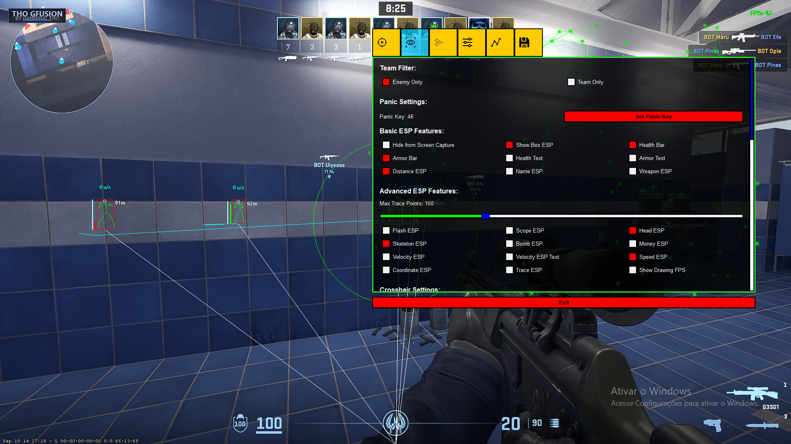

# THO GFUSION CS2 - External Cheat



An advanced external cheat solution for CS2 with a comprehensive feature set and modern GUI.

## ✨ Features

- 🎯 Aimbot with multiple customization options
- 👁️ ESP (Wallhack) with extensive customization
- 🔄 Triggerbot with delay settings
- 🦘 Bunny Hop
- 🎨 Glow ESP
- 🏃 WalkBot
- 🔫 Auto Pistol
- 📊 FOV Changer
- 🛡️ OBS Protection

## 🎬 Demo

[Watch Demo Video](https://youtube.com/your_demo_video)

## ⚙️ Requirements

- Windows 10/11
- Python 3.10+
- CS2 Game
- Administrator privileges

## 📥 Installation

1. Clone the repository
```bash
git clone https://github.com/yourusername/tho-gfusion.git
cd tho-gfusion
```

2. Run the installation batch file
```bash
install_requirements.bat
```

3. Launch the cheat
```bash
start.pyw
```

## 🔧 Usage

1. Launch CS2
2. Run the cheat using `start.pyw`
3. Press the assigned key to toggle the menu (default: INSERT)
4. Configure your settings
5. Enjoy!

## ⚠️ Disclaimer

This project is for educational purposes only. Use at your own risk. We take no responsibility for any bans or consequences.

## 🤝 Community

Join our Discord community for support, updates and discussions:

[![Discord][(https://discord.com/api/guilds/[server-id]/widget.png?style=banner2)](https://discord.com/api/guilds/1396624126256349256/widget.json)](https://discord.gg/uPESr5v7yQ)

## 🔑 Key Features Details

### Aimbot
- Configurable FOV
- Smooth aim
- Multiple targeting options
- RCS (Recoil Control System)

### ESP
- Box ESP
- Health bars
- Armor bars
- Name ESP
- Weapon ESP
- Distance ESP
- Skeleton ESP
- Configurable colors

### Triggerbot
- Customizable delay
- Team check
- Custom key binding

### More
- Fully customizable settings
- Modern GUI interface
- Regular updates
- Active community support

## 📝 License

This project is licensed under the MIT License - see the [LICENSE](LICENSE) file for details.

## 🌟 Credits


Created with ❤️ by Hannibal THO
